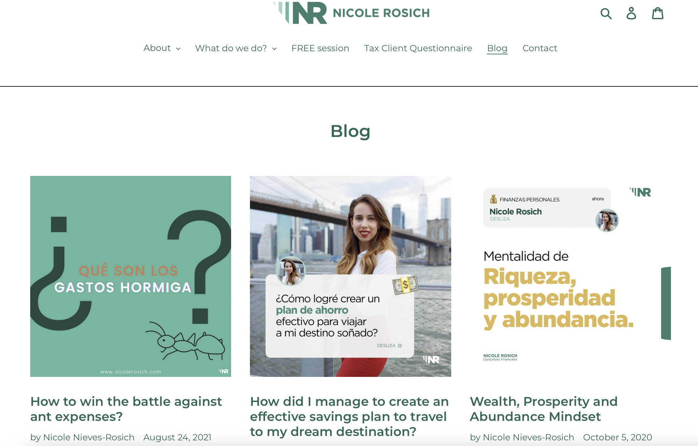

Rossellinie Corp is a creative tech studio. We specialize in web design and development, photography, creactive direction, production, marketing, and consultation.

## Projects

    <h2>miramira New York</h2>
    
Minimalist jewelry brand based in New York.

    
Jewelry inspired by less is more. Minimalism takes on simple sophistication. The jewelry borrows vintage elements to create a modern image that empowers everyone to have endless options with good basics to elevate your everyday outfit. Simplicity is the ultimate asset to feel and look effortlessly.

    
Available online at miramiranyc.com or in-store at Fireplace409 in West Village

<figure>
<picture>
<source srcset="img/homepage-mm.png" media="(min-width: 1200px)">
<source srcset="img/homepage-mm.png" media="(min-width: 800px)">

</picture>
<figcaption>Instagram carrousel front-end for miramira New York</figcaption>
</figure>

    

    <h3>Nicole Rosich</h3>
    
With her knowledge and experiences She has helped people achieve healthy personal finances, pay off debts and live life on their own terms.

    
She has created this brand to help you in the course of achieving your financial goals under a scheme with resources, tools and individual accompaniment that will help you fulfill your purpose, achieve healthy finances and live a happier life.

<figure>
<picture>
<source srcset="img/blog-nrosich.png" media="(min-width: 1200px)">
<source srcset="img/blog-nrosich.png" media="(min-width: 800px)">

</picture>
<figcaption>Nicole Rosich blog view-page</figcaption>
</figure>

<footer>
    <h3><a href="#" title="Back to top">Rossellinie Corp!</a></h3>
    
 Stay in the loop and subscribe to our newsletters 

<button>Enter your email address here</button>
</footer>

<a class="closer" href="#">X</a>
<iframe src="img/apples-red.png" width="300" height="225" frameboder="0" style="border: 0" allowfullscreen=""></iframe>

<picture>
<source srcset="img/interface-logos.jpg" media="(min-width: 400px)">
<source srcset="img/interface-logos.jpg" media="(min-width: 200px)">

</picture>